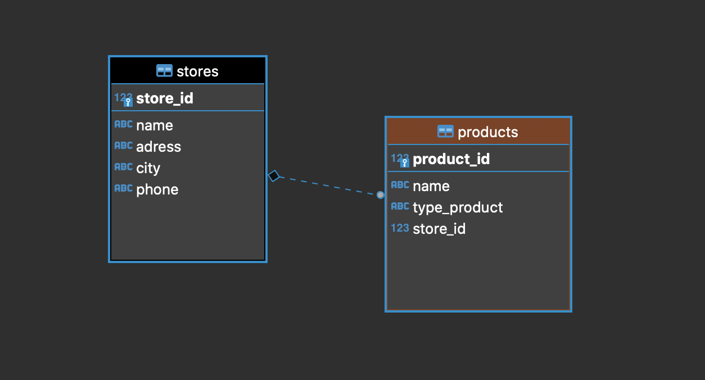

# Inventario
This is a very small inventory system, with a database to handle and saving the information.

## Functionality
- The user can add a new store, with the correct info; The system have the warnings to show if something went wrong.
- The user can add a product, with the correct innfo; Also the system have wwarnigns to show if somethng went wirng with the insertion.
> *There are several things to improve or add to the current functionality*

## Technologies used:
- Flask: Main framework to manage the functionality.
- Postgresql: The creation fo the database.
- Python: The principal programming language
- HTML y Boostrap: This for the creation and the style of the pages.
> This is my first time using postgresql and flask to create an app

## Design of the database
This is the current design of the database, very simple, a relation 1 to N
Tables:
- Stores: Basic info about the store like, Name, Phone, Adress, City.
- Products: Basic info about the product like, Name, Type of the prodcut, in which Store is.

